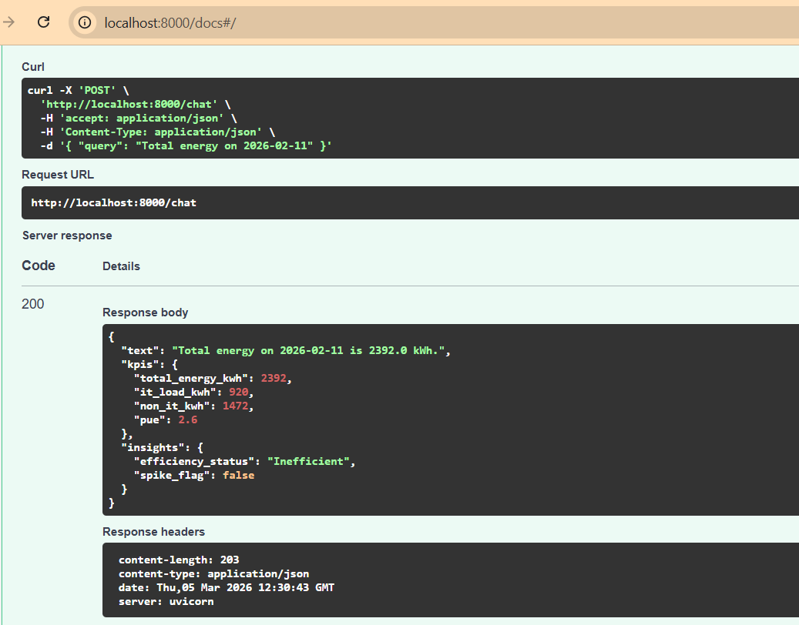
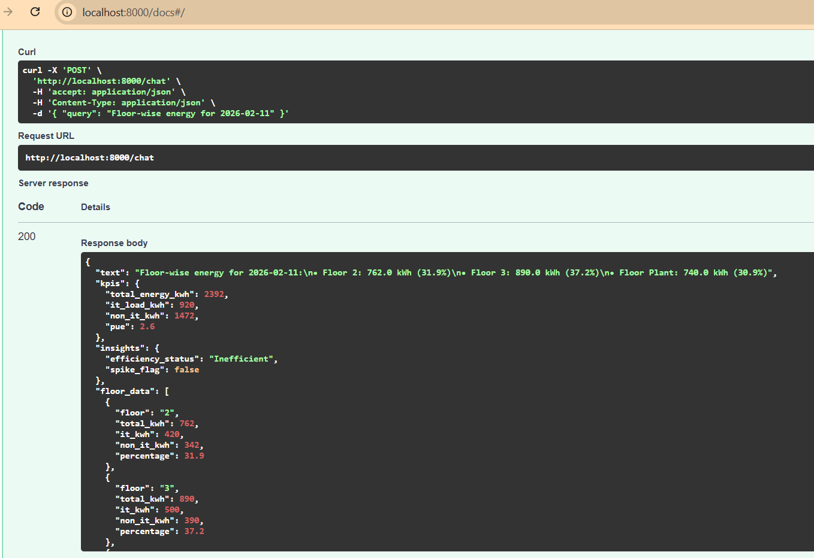
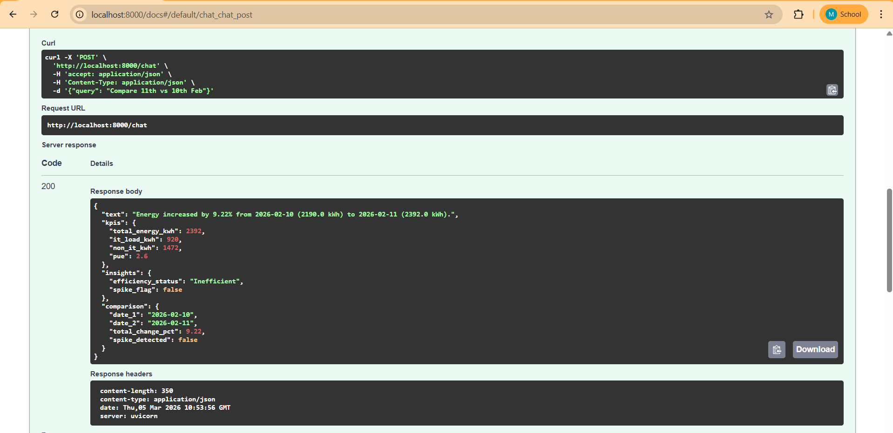
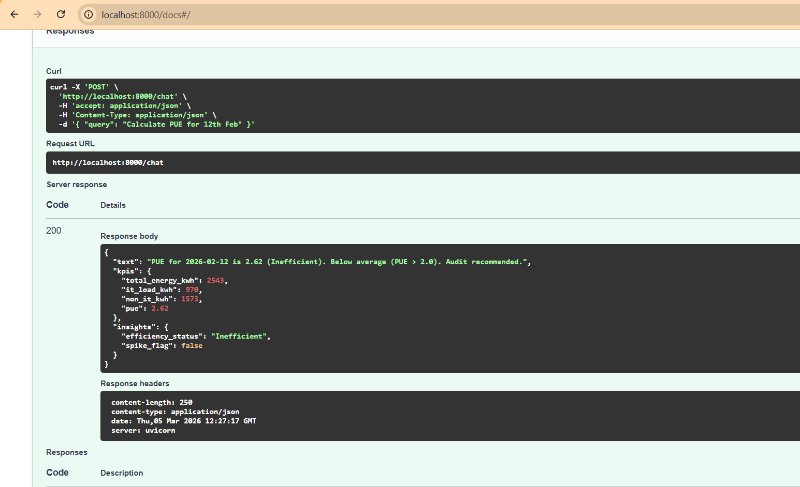
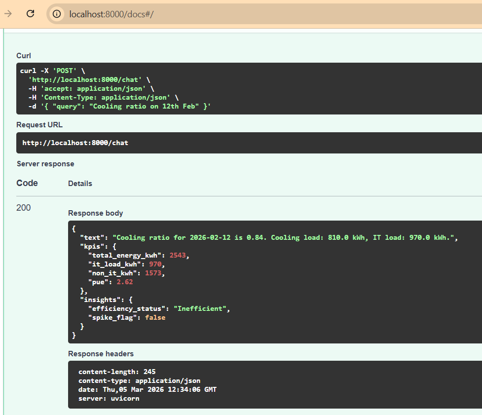

#  Energy Management AI Chatbot

## Overview

Energy data sitting in CSV files is useless unless someone can ask questions about it in plain English. This project solves that.

It is a **FastAPI-based chatbot** that accepts natural language queries like *"What was the PUE on 12th Feb?"* and returns structured JSON with exact numbers, efficiency labels, and spike alerts — all calculated from raw meter data.

The key design decision: **GPT-4o-mini only reads the question. It never touches the numbers.** All calculations are done by Pandas using the exact formulas from the assignment. This means the answers are always mathematically correct, regardless of what the LLM does.

---

## How a Query Flows Through the System

```
You type: "Compare 11th vs 10th Feb"
          │
          ▼
┌─────────────────────────────────────┐
│  FastAPI  — /chat endpoint          │
│  Receives the query as JSON         │
└──────────────┬──────────────────────┘
               │
               ▼
┌─────────────────────────────────────┐
│  LLM Layer  — GPT-4o-mini           │
│  Reads the question                 │
│  Returns:                           │
│  {                                  │
│    "intent": "comparison",          │
│    "date_1": "2026-02-10",          │
│    "date_2": "2026-02-11",          │
│    "metric": "total_energy"         │
│  }                                  │
└──────────────┬──────────────────────┘
               │
               ▼
┌─────────────────────────────────────┐
│  Validation Layer  — Pydantic       │
│  Checks LLM output has correct      │
│  fields and allowed values          │
│  Rejects garbage before it crashes  │
└──────────────┬──────────────────────┘
               │
               ▼
┌─────────────────────────────────────┐
│  Calculation Engine  — Pandas       │
│  Loads CSV data                     │
│  Runs exact formulas:               │
│    PUE = Total / IT Load            │
│    % Change = (D2-D1)/D1 × 100      │
│    Spike = |%| > 15%                │
│  Zero LLM involvement here          │
└──────────────┬──────────────────────┘
               │
               ▼
┌─────────────────────────────────────┐
│  Insight Generator                  │
│  PUE → Excellent/Efficient/         │
│         Moderate/Inefficient        │
│  spike_flag → true / false          │
└──────────────┬──────────────────────┘
               │
               ▼
┌─────────────────────────────────────┐
│  Structured JSON Response           │
│  {                                  │
│    "text": "...",                   │
│    "kpis": { ... },                 │
│    "insights": { ... }              │
│  }                                  │
└─────────────────────────────────────┘
```

---

## Project Structure

```
energy_management_chatbot/
│
├── main.py                        ← Starts the server, handles /chat route
├── .env                           ← Your API key lives here (never on GitHub)
├── requirements.txt               ← All packages to install
│
├── app/
│   ├── models/
│   │   ├── intent.py              ← Defines what LLM must return
│   │   └── response.py            ← Defines what API sends back
│   │
│   ├── services/
│   │   ├── data_service.py        ← Loads CSV files, filters by date
│   │   ├── llm_service.py         ← Sends query to GPT, gets intent back
│   │   └── calculation_service.py ← Every formula lives here
│
├── data/
│   ├── energy_meter_readings.csv  ← Raw meter readings
│   └── meter_metadata.csv         ← Meter info (floor, type, category)
│
├── screenshots/                   ← Result screenshots for this README
│   ├── query1_total_energy.png
│   ├── query2_floor_wise.png
│   ├── query3_comparison.png
│   ├── query4_pue.png
│   └── query5_cooling_ratio.png
│
└── tests/
    └── test_calculations.py       ← 14 tests, no API key needed
```

---

## Data Sources

### energy_meter_readings.csv

| Column | What it contains |
|---|---|
| timestamp | When the reading was taken |
| meter_id | Which meter |
| meter_name | Name of the meter |
| floor | Which floor (2, 3, Plant) |
| energy_difference_wh | Energy used in Watt-hours |

### meter_metadata.csv

| Column | What it contains |
|---|---|
| meter_id | Which meter (used to join both files) |
| meter_category | UPS, CHILLER, HVAC, etc. |
| load_type | IT or NON_IT |

Both files are joined on `meter_id` so every reading row knows its floor, category, and load type.

---

## Engineering Formulas

Every number in the response comes from one of these formulas:

| What | Formula |
|---|---|
| kWh conversion | `energy_difference_wh / 1000` |
| IT Load | `Sum(kWh) where load_type = 'IT'` |
| Total Facility Load | `Sum(all kWh)` |
| Non-IT Load | `Total − IT Load` |
| Cooling Load | `Sum(kWh) where meter_category = 'CHILLER'` |
| PUE | `Total / IT Load` |
| Cooling Ratio | `Cooling / IT Load` |
| Daily % Change | `((Day2 − Day1) / Day1) × 100` |
| Spike Rule | `If % Change > 15% → spike_flag = true` |

### PUE Efficiency Classification

| PUE Value | Label |
|---|---|
| ≤ 1.2 | Excellent |
| 1.2 – 1.5 | Efficient |
| 1.5 – 2.0 | Moderate |
| > 2.0 | Inefficient |

---

## All 5 Supported Queries

### 1 — Total energy on a date

**Request:**
```json
{ "query": "Total energy on 2026-02-11" }
```

**Response:**
```json
{
  "text": "Total energy on 2026-02-11 is 2392.0 kWh.",
  "kpis": {
    "total_energy_kwh": 2392,
    "it_load_kwh": 920,
    "non_it_kwh": 1472,
    "pue": 2.6
  },
  "insights": {
    "efficiency_status": "Inefficient",
    "spike_flag": false
  }
}
```

**Screenshot:**



---

### 2 — Floor-wise energy breakdown

**Request:**
```json
{ "query": "Floor-wise energy for 2026-02-11" }
```

**Response:**
```json
{
  "text": "Floor-wise energy for 2026-02-11:\n• Floor 2: 762.0 kWh (31.9%)\n• Floor 3: 890.0 kWh (37.2%)\n• Floor Plant: 740.0 kWh (30.9%)",
  "kpis": {
    "total_energy_kwh": 2392,
    "it_load_kwh": 920,
    "non_it_kwh": 1472,
    "pue": 2.6
  },
  "insights": { "efficiency_status": "Inefficient", "spike_flag": false },
  "floor_data": [
    { "floor": "2",     "total_kwh": 762.0, "it_kwh": 420.0, "non_it_kwh": 342.0, "percentage": 31.9 },
    { "floor": "3",     "total_kwh": 890.0, "it_kwh": 500.0, "non_it_kwh": 390.0, "percentage": 37.2 },
    { "floor": "Plant", "total_kwh": 740.0, "it_kwh": 0.0,   "non_it_kwh": 740.0, "percentage": 30.9 }
  ]
}
```

**Screenshot:**



---

### 3 — Compare two dates

**Request:**
```json
{ "query": "Compare 11th vs 10th Feb" }
```

**Response:**
```json
{
  "text": "Energy increased by 9.22% from 2026-02-10 (2190.0 kWh) to 2026-02-11 (2392.0 kWh).",
  "kpis": {
    "total_energy_kwh": 2392,
    "it_load_kwh": 920,
    "non_it_kwh": 1472,
    "pue": 2.6
  },
  "insights": { "efficiency_status": "Inefficient", "spike_flag": false },
  "comparison": {
    "date_1": "2026-02-10",
    "date_2": "2026-02-11",
    "total_change_pct": 9.22,
    "spike_detected": false
  }
}
```

> To trigger a spike, try: `"Compare 10th vs 12th Feb"` — change is 16.12% which crosses the 15% threshold and sets `spike_flag: true`

**Screenshot:**



---

### 4 — PUE analysis

**Request:**
```json
{ "query": "Calculate PUE for 12th Feb" }
```

**Response:**
```json
{
  "text": "PUE for 2026-02-12 is 2.62 (Inefficient). Below average (PUE > 2.0). Audit recommended.",
  "kpis": {
    "total_energy_kwh": 2543,
    "it_load_kwh": 970,
    "non_it_kwh": 1573,
    "pue": 2.62
  },
  "insights": { "efficiency_status": "Inefficient", "spike_flag": false }
}
```

**Screenshot:**



---

### 5 — Cooling ratio

**Request:**
```json
{ "query": "Cooling ratio on 12th Feb" }
```

**Response:**
```json
{
  "text": "Cooling ratio for 2026-02-12 is 0.84. Cooling load: 810.0 kWh, IT load: 970.0 kWh.",
  "kpis": {
    "total_energy_kwh": 2543,
    "it_load_kwh": 970,
    "non_it_kwh": 1573,
    "pue": 2.62
  },
  "insights": { "efficiency_status": "Inefficient", "spike_flag": false }
}
```

**Screenshot:**



---

## Setup and Run

**Step 1 — Clone the repo**
```bash
git clone <repository_url>
cd energy_management_chatbot
```

**Step 2 — Create virtual environment**
```bash
python -m venv venv
venv\Scripts\activate        # Windows
source venv/bin/activate     # Mac/Linux
```

**Step 3 — Install packages**
```bash
pip install -r requirements.txt
```

**Step 4 — Add your API key**

Create a `.env` file in the root folder:
```
OPENROUTER_API_KEY=your_key_here
OPENROUTER_MODEL=gpt-4o-mini
```

**Step 5 — Start the server**
```bash
uvicorn main:app --reload
```

**Step 6 — Test in browser**
```
http://localhost:8000/docs
```

---

## Run Tests

```bash
python -m pytest tests/ -v
```

14 tests — covers all formulas, PUE classification, spike rule, and all 5 query types. No API key needed.

---

## Tech Stack

| Tool | Why it is used |
|---|---|
| FastAPI | Creates the /chat API endpoint |
| Pandas | Reads CSV files and runs all calculations |
| Pydantic | Validates LLM output before calculations run |
| OpenAI SDK | Sends queries to GPT-4o-mini |
| OpenRouter | API gateway to access GPT-4o-mini |
| python-dotenv | Reads API key from .env file |
| pytest | Runs unit tests on all formulas |
